Question - 1
------------

    ggplot(carrierDest) + 
      geom_col(aes(x = factor(Dest), y = mean_dep_delay)) + 
      facet_wrap(~UniqueCarrier)

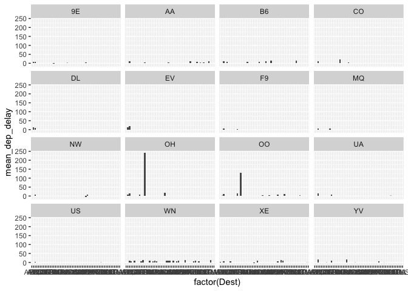

    ggplot(carrierDest) + 
      geom_col(aes(x = factor(Dest), y = mean_arr_delay)) + 
      facet_wrap(~UniqueCarrier)

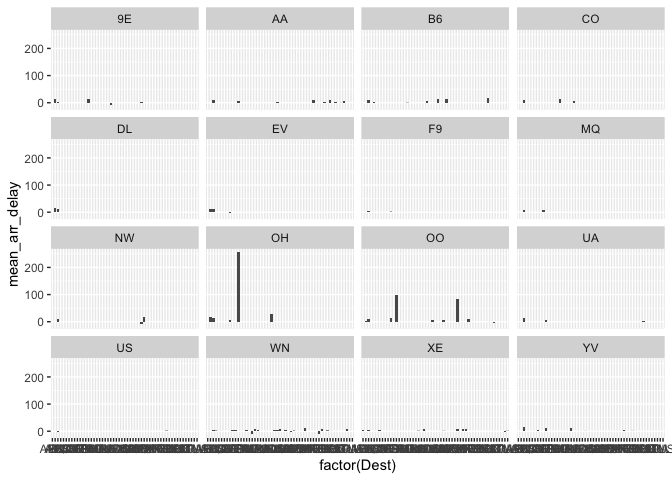

According to the graph above, we noticed that mean delays were off the
charts with the carriers OH and OO. So we’ll focus on the reason behind
the delays. If the reason is weather (which cant be controlled - except
NAS), we do not consider the carrier as one of the worst.

#### OH - Jetsream Intl.

    OH_delays = ABIA %>%
      group_by(UniqueCarrier, Origin) %>%
      filter (UniqueCarrier == "OH") %>%
      summarise(meanCarDel = mean(CarrierDelay, na.rm = TRUE),
                meanWeaDel = mean(WeatherDelay, na.rm = TRUE),
                meanNASDel = mean(NASDelay, na.rm = TRUE),
                meanSecDel = mean(SecurityDelay, na.rm = TRUE),
                meanLADel = mean(LateAircraftDelay, na.rm = TRUE), count = n())

    ggplot(OH_delays) + 
      geom_col(aes(x = Origin, y = meanCarDel)) +
      labs(title = "Delays due to the carrier")

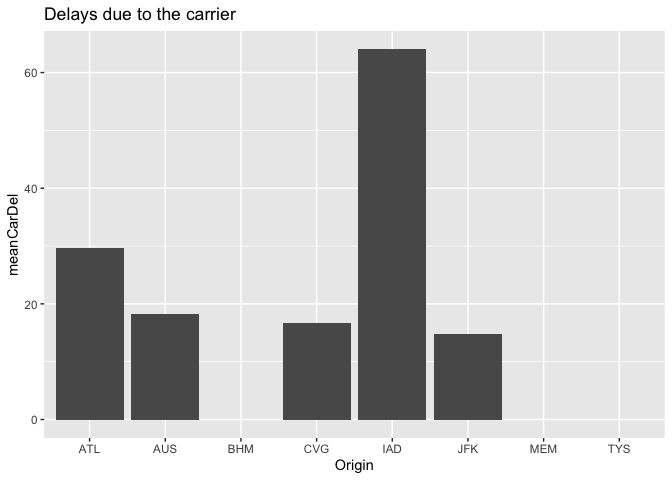

    ggplot(OH_delays) + 
      geom_col(aes(x = Origin, y = meanWeaDel)) +
      labs(title = "Delays due to the Weather")

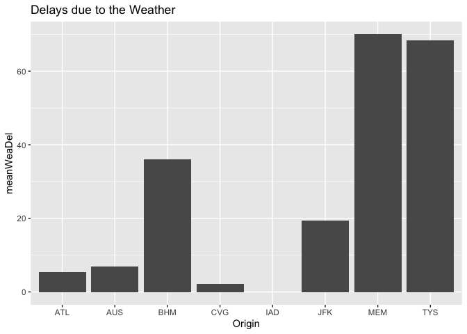

    ggplot(OH_delays) + 
      geom_col(aes(x = Origin, y = meanNASDel)) +
      labs(title = "NAS Delays")

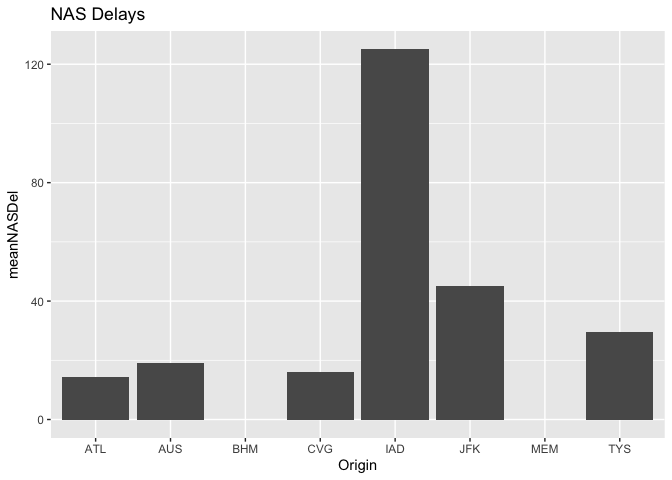

    ggplot(OH_delays) + 
      geom_col(aes(x = Origin, y = meanSecDel)) +
      labs(title = "Delays due to the Security")

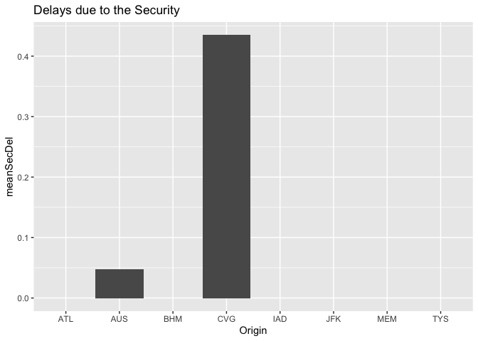

    ggplot(OH_delays) + 
      geom_col(aes(x = Origin, y = meanLADel)) +
      labs(title = "Delays due to the Late Arrivals")

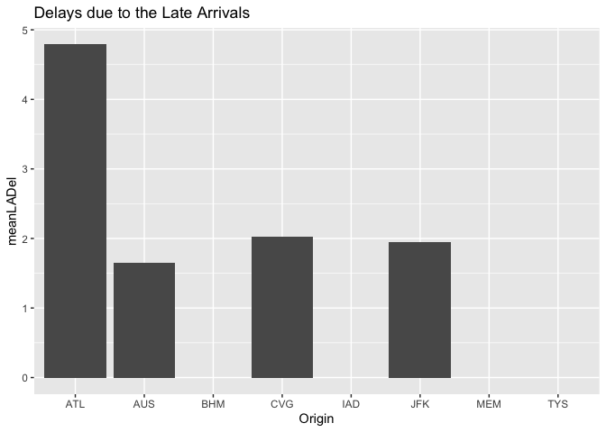

#### OO - Skywest Airlines

    OO_delays = ABIA %>%
      group_by(UniqueCarrier, Origin) %>%
      filter (UniqueCarrier == "OO") %>%
      summarise(meanCarDel2 = mean(CarrierDelay, na.rm = TRUE),
                meanWeaDel2 = mean(WeatherDelay, na.rm = TRUE),
                meanNASDel2 = mean(NASDelay, na.rm = TRUE),
                meanSecDel2 = mean(SecurityDelay, na.rm = TRUE),
                meanLADel2 = mean(LateAircraftDelay, na.rm = TRUE), count = n())

    ggplot(OO_delays) + 
      geom_col(aes(x = Origin, y = meanCarDel2)) + 
      labs(title = "Delays due to the carrier")

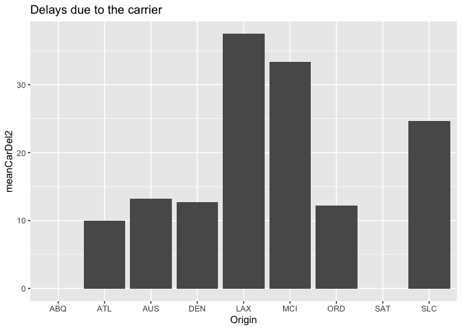

    ggplot(OO_delays) + 
      geom_col(aes(x = Origin, y = meanWeaDel2)) +
      labs(title = "Delays due to the Weather")

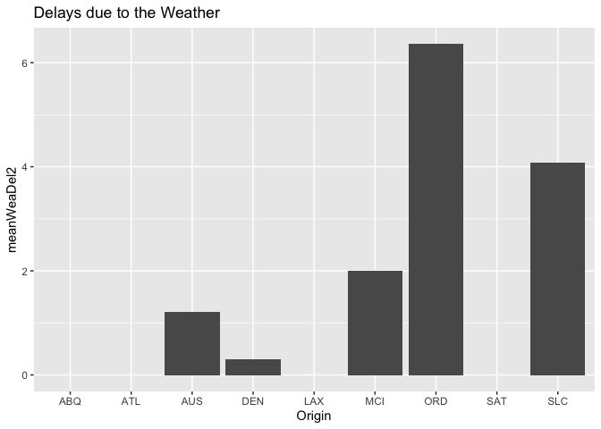

    ggplot(OO_delays) + 
      geom_col(aes(x = Origin, y = meanNASDel2)) +
      labs(title = "NAS Delaysr")

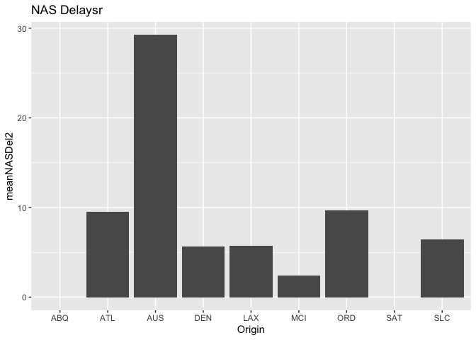

    ggplot(OO_delays) + 
      geom_col(aes(x = Origin, y = meanSecDel2)) +
      labs(title = "Delays due to the Security")

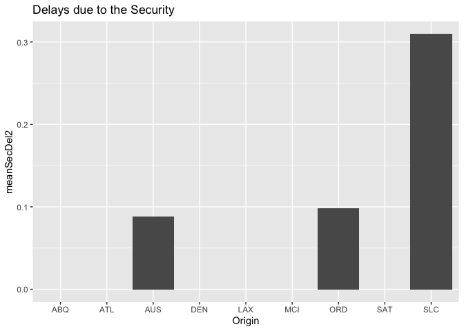

    ggplot(OO_delays) + 
      geom_col(aes(x = Origin, y = meanLADel2)) +
      labs(title = "Delays due to the Late Arrivals")

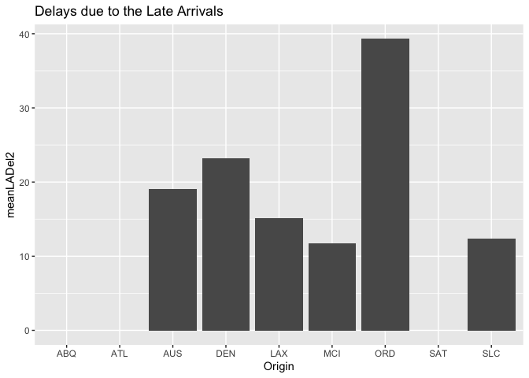

Looks like weather delays were not the primary reason for delays out of
the five, for the two carriers.

This helps us realize that the worst Carriers to travel with are ‘OH’-
“Jetstream Intl” and ‘OO’ - “Skywest Airlines” as the delays which are
not inevitable are the highest in these two airlines.

#### Now we will try to find out which are the best/worst months to travel in.

    monthly_del = ABIA %>%
      group_by(Month) %>%
      summarize(mean_dep_delay = mean(DepDelay, na.rm=TRUE), 
                mean_arr_delay = mean(ArrDelay, na.rm=TRUE), count = n())

    ggplot(monthly_del) +
      geom_col(aes(x = Month, y = mean_dep_delay)) + 
      labs(title = "Mean Departure Delay by month")

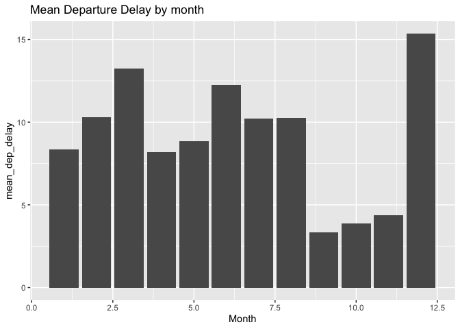

    ggplot(monthly_del) +
      geom_col(aes(x = Month, y = mean_arr_delay)) + 
      labs(title = "Mean Arrival Delay by month")

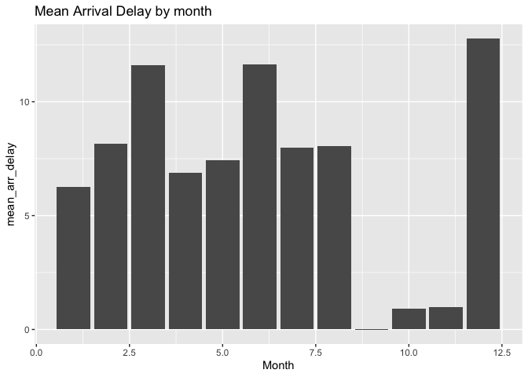

According to the graphs above, the best months to travel in are -
September, October and November as the delays are the least during this
time.

Question - 2
------------

#### Top 10 songs of all time

    library(tidyverse)
    library(ggplot2)

    top_10 = billboard %>%
      group_by(song, performer) %>%
      filter(week_position == 1) %>%
      summarize(count = n()) %>%
      arrange(desc(count)) %>%
      head(10) 

    top_10

    ## # A tibble: 10 × 3
    ## # Groups:   song [10]
    ##    song                                                             performer                  count
    ##    <chr>                                                            <chr>                      <int>
    ##  1 Old Town Road                                                    Lil Nas X Featuring Billy…    19
    ##  2 Despacito                                                        Luis Fonsi & Daddy Yankee…    16
    ##  3 One Sweet Day                                                    Mariah Carey & Boyz II Men    16
    ##  4 Candle In The Wind 1997/Something About The Way You Look Tonight Elton John                    14
    ##  5 I Gotta Feeling                                                  The Black Eyed Peas           14
    ##  6 I Will Always Love You                                           Whitney Houston               14
    ##  7 I'll Make Love To You                                            Boyz II Men                   14
    ##  8 Macarena (Bayside Boys Mix)                                      Los Del Rio                   14
    ##  9 Uptown Funk!                                                     Mark Ronson Featuring Bru…    14
    ## 10 We Belong Together                                               Mariah Carey                  14

    diversity_table = billboard %>%
      group_by(year, song, performer) %>%
      filter(year != 1958, year != 2021) %>%
      summarize(count = n())

    yearly_diversity = diversity_table %>%
      group_by(year) %>%
      summarize(count = n())

    ggplot(yearly_diversity) + 
      geom_line(aes(x = year, y = count)) + 
      labs(title = "Musical Diversity", y = "no. of songs in that year")

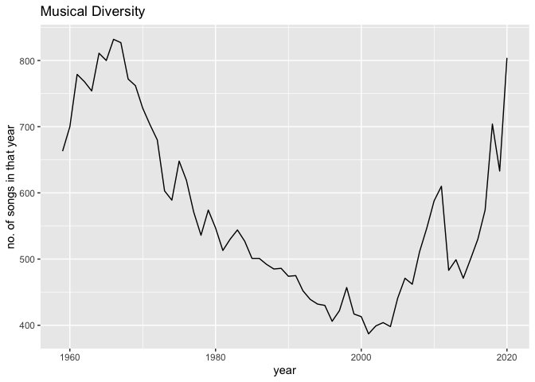

The graph suggests that musical diversity was the highest in the 60s,
which declined and dipped in the 90s and 2000s. The diversity is
climbing up steeply again.

    big_hits = billboard %>%
      group_by(song, performer) %>%
      summarize(count = n())

    ## `summarise()` has grouped output by 'song'. You can override using the `.groups` argument.

    ten_week_hits = big_hits %>%
      filter(count >= 10) %>%
      group_by(Artist = performer) %>%
      summarize(Count = n()) %>%
      filter(Count>=30) %>%
      arrange(desc(Count))

    ggplot(ten_week_hits) +
      geom_col(aes(x = Artist, y = Count)) +
      coord_flip() +
      labs(title = "30 X 10-Week-Hits by Artist")

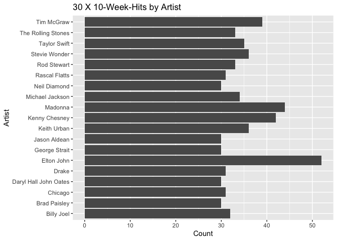

Question - 3
------------

95th quantile for all females across all Athletics events:

    olympics_top20 %>%
      group_by(sex) %>%
      filter(sex == "F", sport == "Athletics") %>%
      summarize(quantile(height, 0.95))

    ## # A tibble: 1 × 2
    ##   sex   `quantile(height, 0.95)`
    ##   <chr>                    <dbl>
    ## 1 F                          183

#### Variation in women’s heights by event:

    fem_sd_height = olympics_top20 %>%
      group_by(event) %>%
      filter(sex == "F") %>%
      summarise(sd_height = sd(height)) %>%
      arrange(desc(sd_height))

    fem_sd_height

    ## # A tibble: 132 × 2
    ##    event                                 sd_height
    ##    <chr>                                     <dbl>
    ##  1 Rowing Women's Coxed Fours                10.9 
    ##  2 Basketball Women's Basketball              9.70
    ##  3 Rowing Women's Coxed Quadruple Sculls      9.25
    ##  4 Rowing Women's Coxed Eights                8.74
    ##  5 Swimming Women's 100 metres Butterfly      8.13
    ##  6 Volleyball Women's Volleyball              8.10
    ##  7 Gymnastics Women's Uneven Bars             8.02
    ##  8 Shooting Women's Double Trap               7.83
    ##  9 Cycling Women's Keirin                     7.76
    ## 10 Swimming Women's 400 metres Freestyle      7.62
    ## # … with 122 more rows

According to this table, the event with the highest variability in
female heights is: Rowing Women’s Coxed Fours

    avg_age = olympics_top20 %>%
      group_by(year) %>%
      filter(sport == "Swimming",) %>%
      summarize(avg_age = mean(age)) %>%
      arrange(year)

    ggplot(avg_age) +
      geom_line(aes(x = year, y = avg_age)) +
      labs(title = "Change in average age of Swimmers")

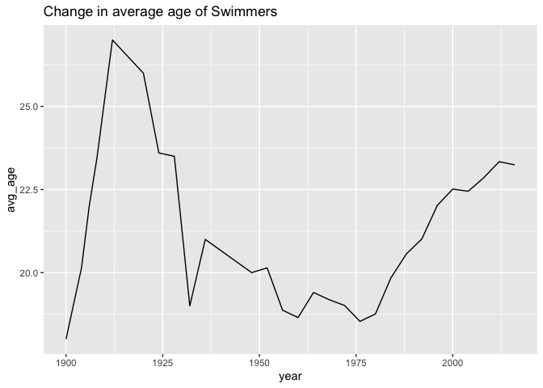

This graph was true for all swimmers Now let us look at each sex
individually.

    male_avg_age = olympics_top20 %>%
      group_by(year) %>%
      filter(sport == "Swimming", sex == "M") %>%
      summarize(male_avg_age = mean(age)) %>%
      arrange(year)

    fem_avg_age = olympics_top20 %>%
      group_by(year) %>%
      filter(sport == "Swimming", sex == "F") %>%
      summarize(fem_avg_age = mean(age)) 

    combined_avg_age = merge(male_avg_age, fem_avg_age, by.x = "year")

    ggplot(combined_avg_age) + 
      geom_line(aes(x = year, y = male_avg_age), colour = "darkred") +
      geom_line(aes(x = year, y = fem_avg_age), colour = "steelblue") +
      labs(title = "Change in average age of Male and Female Swimmers", x = "Year", y = "Average Age")

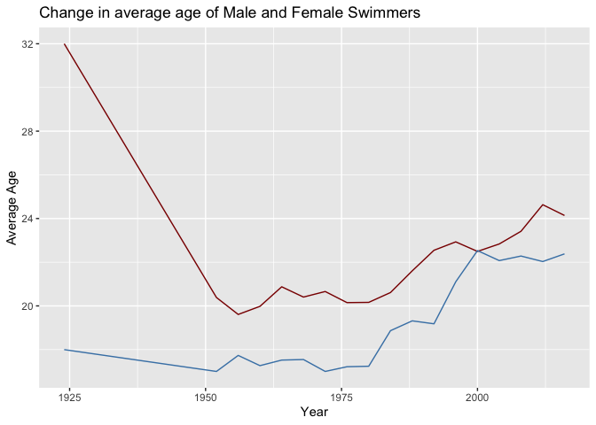

The average age of male swimmers seems to have fallen and is gradually
rising. The average age of female swimmers, however started low and is
now gradually rising.

Question - 4
------------

    library(tidyverse)
    library(rsample)
    library(caret)
    library(foreach)

    trim_350 = sclass %>%
      filter(trim == "350") %>%
      summarize(mileage, price)

    trim_350_split = initial_split(trim_350, prop = 0.8)
    trim_350_train = training(trim_350_split)
    trim_350_test = testing(trim_350_split)

    k_grid = c(2, 4, 6, 8, 10, 15, 20, 25, 30, 35, 40, 45,
               50, 60, 70, 80, 90, 100, 125, 150, 175, 200)

    trim350_grid = foreach(k = k_grid, .combine = 'rbind') %dopar% {
      knn = knnreg(price ~ mileage, data=trim_350_train, k = k)
      err = modelr::rmse(knn, trim_350_test)
      c(k=k, err = err)
    } %>% as.data.frame

    ggplot(trim350_grid) +
      geom_point(aes(x=k, y=err)) + 
      labs(x = "K", y = "RMSE", title = "RMSE~K for sclass 350's")

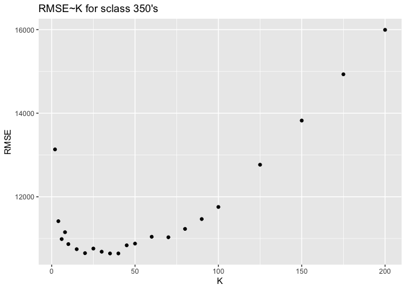

#### The statistics for the least RMSE for 350’s are:

    trim350_grid %>% filter(err == min(trim350_grid$err))

    ##            k      err
    ## result.10 35 10643.94

    trim_350_test = trim_350_test %>%
      mutate(price_pred = predict(knnreg(price ~ mileage, data=trim_350_train, k = 20), trim_350_test))

    ggplot(data = trim_350_test) + 
      geom_point(aes(x = mileage, y = price)) +
      geom_line(aes(x = mileage, y = price_pred), colour = "darkred") + 
      labs(title = "Observed Values and Fitted line for price~mileage - 350's")

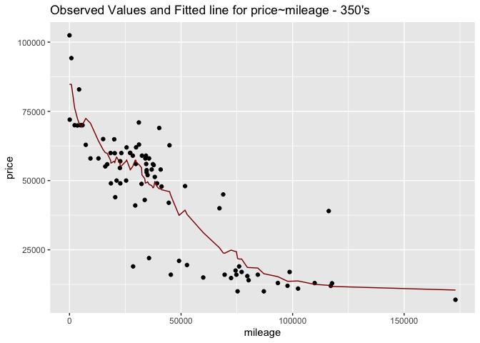

    trim_65amg = sclass %>%
      filter(trim == "65 AMG") %>%
      summarize(mileage, price)

    trim_65amg_split = initial_split(trim_350, prop = 0.8)
    trim_65amg_train = training(trim_65amg_split)
    trim_65amg_test = testing(trim_65amg_split)

    trim65_grid = foreach(k = k_grid, .combine = 'rbind') %dopar% {
      knn = knnreg(price ~ mileage, data=trim_65amg_train, k = k)
      err = modelr::rmse(knn, trim_65amg_test)
      c(k=k, err = err)
    } %>% as.data.frame

    ggplot(trim65_grid) +
      geom_point(aes(x=k, y=err)) +
      labs(x = "K", y = "RMSE", title = "RMSE~K for sclass 65 AMG's")

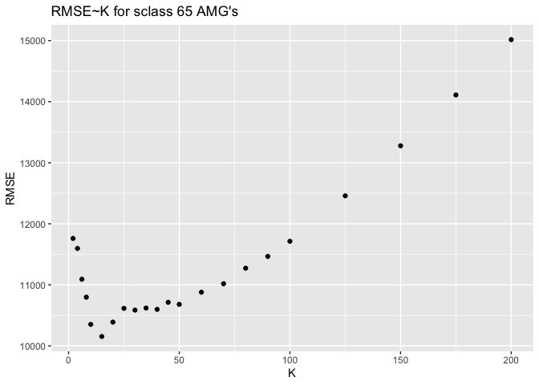

#### The statistics for the least RMSE for 65-AMG’s are:

    trim65_grid %>% filter(err == min(trim65_grid$err))

    ##           k      err
    ## result.6 15 10154.39

    trim_65amg_test = trim_65amg_test %>%
      mutate(price_pred = predict(knnreg(price ~ mileage, data=trim_350_train, k = 15), trim_65amg_test))

    ggplot(data = trim_65amg_test) + 
      geom_point(aes(x = mileage, y = price)) +
      geom_line(aes(x = mileage, y = price_pred), colour = "darkred") + 
      labs(title = "Observed Values and Fitted line for price~mileage - 65 AMG's")

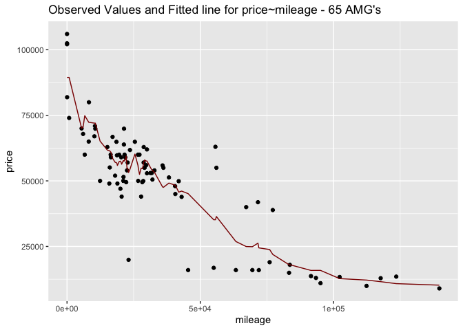

#### The 350’s leads to a larger optimal value of ‘k’.

Optimal K-value for: 350’s = 20 65-AMG’s = 15
